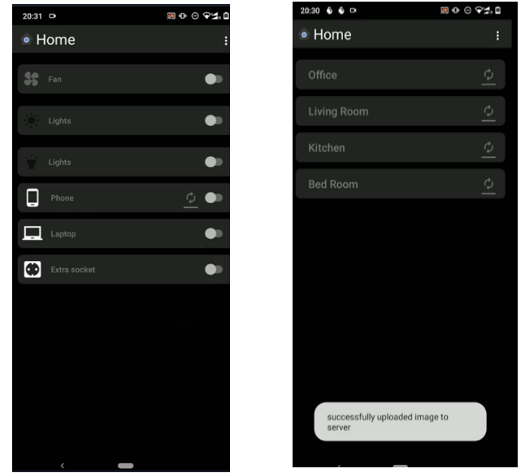
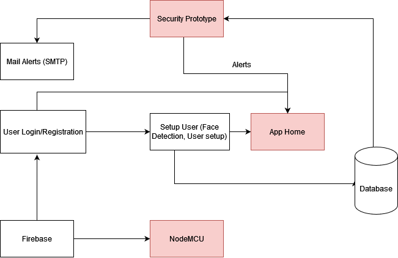

 
<h1 align = "center">Home Automation Prototype</h1>

A home automation prototype that represents a small scaled version of an actual home automation system.

    

## About The Project

 

 

### Features

    - Auto charging (Start/Stop charging during certain battery percentage ranges)
    - Motion sensing lights (Piezo-Electric)
    - Control custom devices (ON/OFF) using the app
    - Security system prototype - facial recognition

### Built With

* [Android Studio](https://developer.android.com/studio)
* [Firebase](https://firebase.google.com/)
* [NodeMCU (Micro Controller)](https://en.wikipedia.org/wiki/NodeMCU)
* [Flask](https://flask.palletsprojects.com/en/2.2.x/)

<!-- CONTRIBUTING -->
## Contributing

We are looking for ways to improve this project through optimizations or new features. Here's how you can contribute:

1. Fork the Project
2. Create your Feature Branch (`git checkout -b feature/AmazingFeature`)
3. Commit your Changes (`git commit -m 'Add some AmazingFeature'`)
4. Push to the Branch (`git push origin feature/AmazingFeature`)
5. Open a Pull Request

